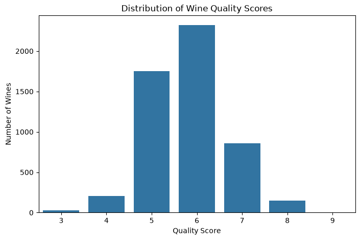
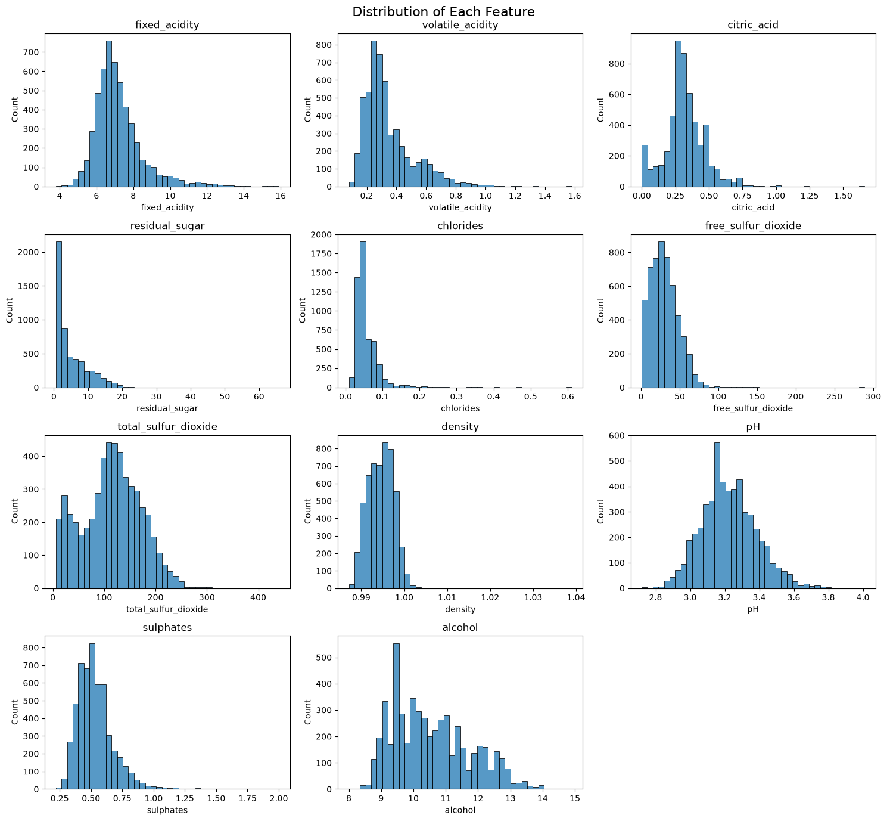
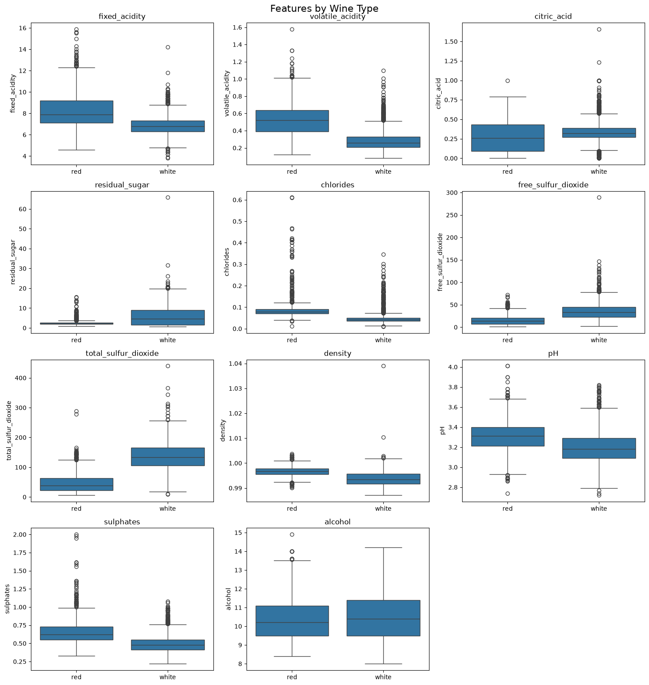
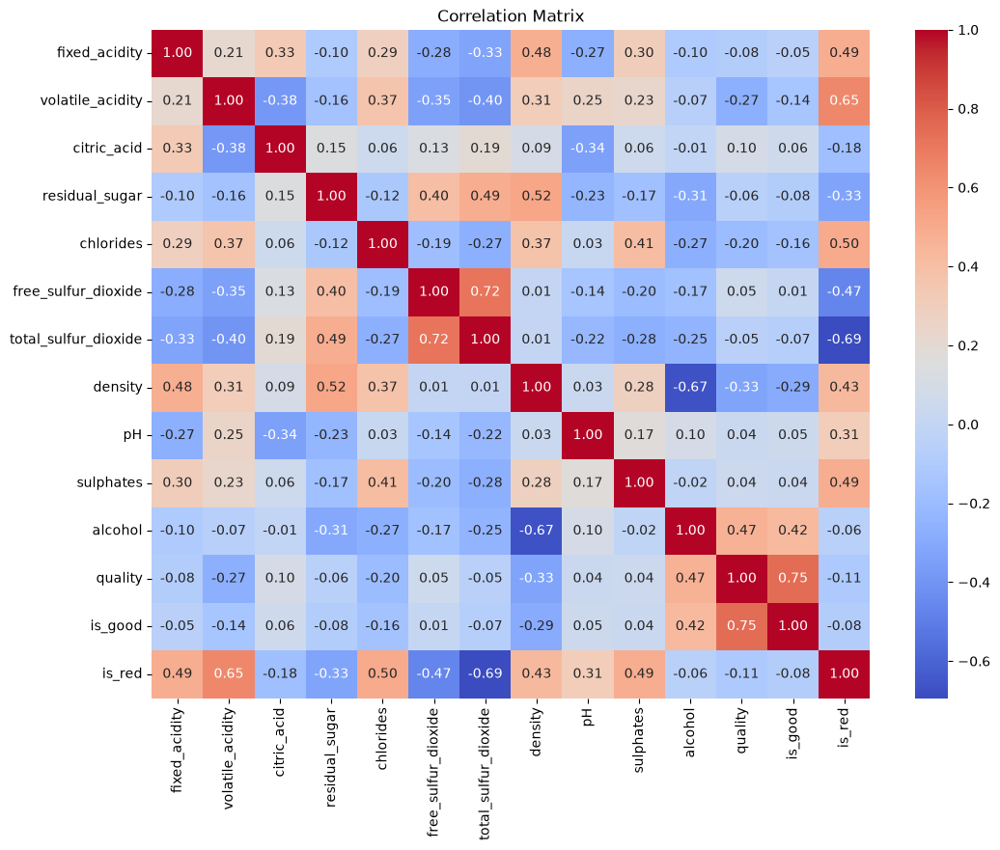
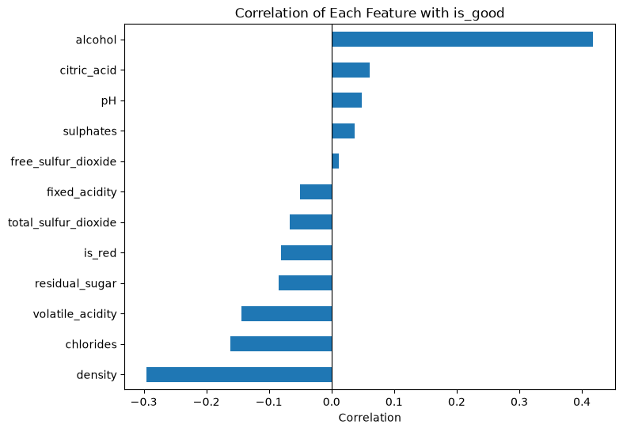
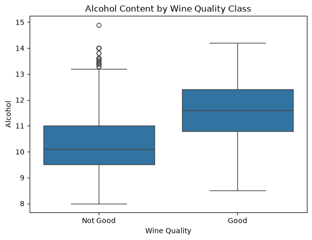

# Exploratory Data Analysis

We explored the full cleaned dataset (`wine_clean.csv`, 5,320 wines) to understand how each feature is distributed, how red and white wines differ, and which features are related to wine quality. The goal was to find out which features are likely to be useful for modeling and which problems the models would need to handle.

## Summary Statistics

Table 3 shows summary statistics for the 11 chemical features. The features are measured on very different scales. Density varies by less than 0.06 g/cm³ across all wines, while total sulfur dioxide ranges from 6 to 440 mg/L. For several features the mean is noticeably larger than the median, especially residual sugar (5.05 vs. 2.70 g/L), which is an early sign of right skew.

**Table 3.** Summary statistics of the chemical features (n = 5,320)

| Feature | Mean | Std. dev. | Min | Median | Max |
|---|---|---|---|---|---|
| Fixed acidity (g/L) | 7.215 | 1.320 | 3.800 | 7.000 | 15.900 |
| Volatile acidity (g/L) | 0.344 | 0.168 | 0.080 | 0.300 | 1.580 |
| Citric acid (g/L) | 0.318 | 0.147 | 0.000 | 0.310 | 1.660 |
| Residual sugar (g/L) | 5.048 | 4.500 | 0.600 | 2.700 | 65.800 |
| Chlorides (g/L) | 0.057 | 0.037 | 0.009 | 0.047 | 0.611 |
| Free sulfur dioxide (mg/L) | 30.037 | 17.805 | 1.000 | 28.000 | 289.000 |
| Total sulfur dioxide (mg/L) | 114.109 | 56.774 | 6.000 | 116.000 | 440.000 |
| Density (g/cm³) | 0.995 | 0.003 | 0.987 | 0.995 | 1.039 |
| pH | 3.225 | 0.160 | 2.720 | 3.210 | 4.010 |
| Sulphates (g/L) | 0.533 | 0.150 | 0.220 | 0.510 | 2.000 |
| Alcohol (% vol.) | 10.549 | 1.186 | 8.000 | 10.400 | 14.900 |

## Distribution of the Target

Figure 1 shows the original quality scores. Most wines received a 5 (1,752 wines) or a 6 (2,323 wines), and very few received the extreme scores of 3 (30 wines) or 9 (5 wines). Using quality ≥ 7 as the cutoff, 1,009 wines (19.0%) are good and 4,311 (81.0%) are not good. Good wines are more common among white wines (20.8%) than red wines (13.5%).

**Figure 1.** Distribution of quality scores. Scores of 7 and above are labeled good.

The imbalance means a model that always predicts "not good" would be 81% accurate while being useless. This confirms that accuracy should not be the main metric for comparing models.

## Feature Distributions

Figure 2 shows a histogram of each feature, and the skewness values confirm what the plots show. Most features are right-skewed, with a long tail of high values. Chlorides is by far the most skewed (skewness 5.34), followed by sulphates (1.81), residual sugar (1.71), fixed acidity (1.65), volatile acidity (1.50), and free sulfur dioxide (1.36). pH, citric acid, alcohol, and density are only mildly skewed.

Total sulfur dioxide has a skewness close to zero (0.06), but its histogram has two peaks. This is not a single symmetric distribution. It is two distributions on top of each other, one for red wines and one for white wines, as the next section shows.

**Figure 2.** Histograms of the 11 chemical features.

Skewed features with very different scales can cause problems for models that rely on distances or linear combinations of the inputs, such as logistic regression. For these models we standardize the features. Tree-based models split on one feature at a time and are not affected by skew or scale.

## Red vs. White Wines

Red and white wines have very different chemistry (Figure 3). The biggest differences are in sulfur dioxide and sugar. White wines have a median total sulfur dioxide of 133 mg/L compared with 38 mg/L for red wines, more than twice as much free sulfur dioxide (33 vs. 14 mg/L), and more than twice as much residual sugar (4.7 vs. 2.2 g/L). Red wines have about twice the volatile acidity (0.52 vs. 0.26 g/L) and chlorides (0.079 vs. 0.042 g/L), and higher sulphates and fixed acidity. Alcohol, density, and pH are similar for both types.

**Figure 3.** Each feature by wine type.

These differences explain many of the outliers found during data cleaning. A value that is normal for one type of wine can look extreme in the combined data. Their quality scores, on the other hand, are similar: the average quality is 5.85 for white wines and 5.62 for red wines. Because wine type affects so many features, we kept `is_red` as a model input so the models can take these differences into account.

## Correlations

Figure 4 shows the correlation matrix of all numeric variables. Two pairs of features are strongly correlated with each other:

- **Free and total sulfur dioxide** (r = 0.72). Free sulfur dioxide is part of the total, so this is expected.
- **Density and alcohol** (r = −0.67). Alcohol is less dense than water, so wines with more alcohol are lighter. Density is also related to residual sugar (r = 0.52), since dissolved sugar makes wine denser.

**Figure 4.** Correlation matrix of all numeric variables.

This multicollinearity does not hurt a model's predictions much, but it can make the coefficients of a linear model unstable and hard to interpret, because the model cannot tell which of two related features is responsible for an effect. We keep this in mind when interpreting the logistic regression model in the Model Analysis section.

Figure 5 shows how each feature is correlated with our target, `is_good`. (The `quality` column is left out because `is_good` is calculated from it.) **Alcohol has by far the strongest relationship with being a good wine (r = 0.42).** Density (r = −0.30), chlorides (r = −0.16), and volatile acidity (r = −0.14) have the strongest negative relationships. The remaining features all have correlations close to zero (|r| < 0.09). On their own they say little about whether a wine is good, although they may still help in combination with other features.

**Figure 5.** Correlation of each feature with `is_good`.

## Features by Quality Class

Table 4 compares the average feature values of good and not good wines. Good wines have more alcohol (11.57% vs. 10.31%), lower volatile acidity (0.294 vs. 0.356 g/L), lower chlorides (0.044 vs. 0.060 g/L), lower density, and less residual sugar and total sulfur dioxide. Sulphates, pH, citric acid, and free sulfur dioxide are almost the same in both groups.

**Table 4.** Average feature values by quality class

| Feature | Not good | Good |
|---|---|---|
| Fixed acidity (g/L) | 7.247 | 7.079 |
| Volatile acidity (g/L) | 0.356 | 0.294 |
| Citric acid (g/L) | 0.314 | 0.337 |
| Residual sugar (g/L) | 5.233 | 4.259 |
| Chlorides (g/L) | 0.060 | 0.044 |
| Free sulfur dioxide (mg/L) | 29.939 | 30.453 |
| Total sulfur dioxide (mg/L) | 115.958 | 106.211 |
| Density (g/cm³) | 0.995 | 0.993 |
| pH | 3.221 | 3.241 |
| Sulphates (g/L) | 0.531 | 0.545 |
| Alcohol (% vol.) | 10.310 | 11.573 |

Figure 6 shows the clearest difference, alcohol. The middle half of good wines falls between 10.8% and 12.4% alcohol (median 11.6%), while the middle half of not good wines falls between 9.5% and 11.0% (median 10.1%). There is still overlap between the groups, so alcohol alone cannot separate good wines from the rest. Box plots of volatile acidity and sulphates, and scatterplots of alcohol and volatile acidity against the quality score, are in the Appendix.

**Figure 6.** Alcohol content of good and not good wines.

All of these relationships are associations. They do not show that changing a feature would change a wine's quality.

## Key Takeaways for Modeling

1. **Class imbalance.** Only 19% of wines are good. Models should be trained with class weights and judged on precision, recall, F1, ROC-AUC, and PR-AUC rather than accuracy.
2. **Most useful features.** Alcohol is the strongest single predictor, followed by density, chlorides, and volatile acidity. No single feature separates the classes well, so a model that combines features is needed.
3. **Skew and scale.** Most features are right-skewed and on very different scales, so logistic regression needs standardized inputs. Tree-based models do not.
4. **Multicollinearity.** Free and total sulfur dioxide, and density, alcohol, and residual sugar, are correlated. This matters most when interpreting linear model coefficients.
5. **Wine type.** Red and white wines have very different chemistry, so `is_red` is kept as an input.
