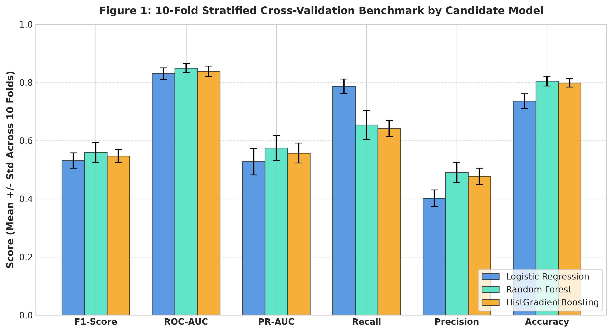

# Model Selection

In this phase, we built and evaluated machine learning classifiers to predict whether a wine is high quality based on its 11 physicochemical measurements and wine type. Following the definition from data cleaning, a wine is good (`is_good = 1`) if its sensory evaluation score is 7 or higher, and ordinary (`is_good = 0`) if its score is 6 or lower.

The feature set includes 12 variables:
- 11 continuous chemical features: fixed acidity, volatile acidity, citric acid, residual sugar, chlorides, free sulfur dioxide, total sulfur dioxide, density, pH, sulphates, and alcohol.
- 1 binary indicator: `is_red` (1 for red wine, 0 for white wine).

To prevent target leakage, the original continuous `quality` score and the text `type` column were dropped before modeling.

---

## Preprocessing and Prevention of Data Leakage

Data leakage happens when information from outside a training fold is used to transform features or select parameters. To prevent leakage:

1. **Strict Partitioning:** The 80/20 stratified split from data cleaning was strictly preserved. All model exploration, scaling, parameter estimation, and cross-validation were conducted exclusively on `train.csv` (N = 4,256). The test partition (`test.csv`, N = 1,064) remained completely untouched until the final evaluation.
2. **Encapsulated Preprocessing Pipelines:** For distance-sensitive algorithms requiring feature normalization (specifically Logistic Regression), standard z-score normalization (`StandardScaler`) was encapsulated within a scikit-learn `Pipeline`. During 10-fold cross-validation, the scaler was fit solely on the 9 training folds in each split and then applied to transform the held-out validation fold. Tree-based models (Random Forest and Gradient Boosting) do not require feature scaling, so they operate directly on the raw chemical values.

---

## Handling Class Imbalance

As documented in data cleaning, the target distribution is notably imbalanced:
- Ordinary Wines (`is_good = 0`): 81.04% of training observations (3,449 samples).
- High-Quality Wines (`is_good = 1`): 18.96% of training observations (807 samples).

A baseline classifier that always predicts the majority class would achieve 81.04% accuracy while failing completely to detect a single high-quality wine. To address this without distorting the data with synthetic oversampling:

1. **Stratified Partitioning:** A 10-fold Stratified K-Fold cross-validation scheme (`StratifiedKFold(n_splits=10, shuffle=True, random_state=42)`) was used for all model comparisons. This guarantees that each validation fold contains the exact 18.96% positive class proportion.
2. **Cost-Sensitive Weighting:** All candidate models incorporated cost-sensitive loss weighting (`class_weight='balanced'`). The loss associated with misclassifying a minority-class observation was scaled inversely to class frequency according to:

$$w_j = \frac{N}{2 \times N_j}$$

where $N$ is the total number of training samples and $N_j$ is the count of samples in class $j$. This assigns a weight of approximately 2.64 to high-quality wines and 0.62 to ordinary wines, penalizing false negatives and compelling the algorithms to balance precision and recall.

---

## Evaluation Metrics

Because the classes are imbalanced, classification accuracy is uninformative. We evaluate each model using five metrics:

1. **Precision:** $\frac{TP}{TP + FP}$. The share of predicted high-quality wines that are truly high quality. High precision protects brand reputation by preventing ordinary wines from being bottled as premium reserves.
2. **Recall (Sensitivity):** $\frac{TP}{TP + FN}$. The share of actual high-quality wines successfully identified by the model. High recall minimizes lost revenue by preventing premium wines from being sold as table wine.
3. **F1-Score:** The harmonic mean of precision and recall ($2 \times \frac{\text{Precision} \times \text{Recall}}{\text{Precision} + \text{Recall}}$). F1-score serves as our primary selection metric because it balances precision and recall without sacrificing either one.
4. **ROC-AUC:** Area Under the Receiver Operating Characteristic curve. Measures overall ranking and discrimination across all classification thresholds, independent of class prevalence.
5. **PR-AUC (Average Precision):** Area Under the Precision-Recall curve. Focuses specifically on the minority class trade-off across all thresholds, evaluated against the 0.1896 random baseline.

---

## Candidate Models

We benchmarked three model families to find the best balance of predictive power, resistance to overfitting, and interpretability:

1. **Logistic Regression (Parametric Baseline):**
   - *Rationale:* A linear reference baseline. It models log-odds as a linear combination of normalized inputs with $L_2$ ridge regularization ($C = 1.0$) and balanced class weights.
   - *Limitations:* Assumes linear decision boundaries and cannot capture non-linear chemical interactions (such as synergies between alcohol, sugar, and volatile acidity) without manual interaction terms.
2. **Random Forest Classifier (Ensemble Bagging: Primary Model):**
   - *Rationale:* An ensemble of 300 decorrelated decision trees built on bootstrap samples with random feature subsampling. Random forest handles skewed chemical distributions, resists outliers, captures non-linear interactions, and mitigates single-tree variance through bagging.
   - *Regularization:* Constrained to a maximum tree depth of 15, minimum split size of 4, and minimum leaf size of 2 to prevent memorizing noise in expert ratings.
3. **Histogram-Based Gradient Boosting (Ensemble Boosting: Comparative Model):**
   - *Rationale:* An iterative sequential boosting model that bins continuous features into 256 integer histograms, optimizing logistic loss through gradient descent.
   - *Configuration:* Evaluated with 200 boosting iterations, a learning rate of 0.08, maximum tree depth of 6, and balanced sample weighting.

---

## Cross-Validation Benchmark

Table 5 summarizes the cross-validation performance of all three candidate architectures across the 10 stratified validation folds. All metrics report the fold mean plus or minus one standard deviation.

**Table 5.** 10-Fold Stratified Cross-Validation Benchmark on Training Dataset (N = 4,256)

| Model Architecture | F1-Score | ROC-AUC | PR-AUC | Recall | Precision | Accuracy |
|---|---|---|---|---|---|---|
| **Logistic Regression (Baseline)** | 0.5316 +/- 0.0263 | 0.8306 +/- 0.0195 | 0.5282 +/- 0.0461 | **0.7869 +/- 0.0250** | 0.4021 +/- 0.0282 | 0.7361 +/- 0.0251 |
| **Random Forest (Final Model)** | **0.5599 +/- 0.0338** | **0.8492 +/- 0.0155** | **0.5747 +/- 0.0423** | 0.6543 +/- 0.0501 | **0.4908 +/- 0.0352** | **0.8050 +/- 0.0170** |
| **HistGradientBoosting** | 0.5473 +/- 0.0216 | 0.8386 +/- 0.0181 | 0.5574 +/- 0.0342 | 0.6419 +/- 0.0283 | 0.4779 +/- 0.0273 | 0.7984 +/- 0.0140 |

*Note: All candidate models utilize balanced class weighting and reproducible seed (random_state = 42). Bold values indicate the superior mean score in each metric column.*

Figure 7 illustrates the comparative performance across all six validation metrics.

### Key Performance Insights:
- **Baseline Trade-off:** Logistic Regression achieved high recall (78.69%) but low precision (40.21%), generating excessive false positive classifications. Its overall F1-score (0.5316) was the lowest among candidate models.
- **Ensemble Superiority:** Random Forest achieved the highest F1-score (0.5599), ROC-AUC (0.8492), PR-AUC (0.5747), and overall accuracy (80.50%). Its precision (49.08%) exceeded the baseline by nearly 9 percentage points.
- **Boosting Comparison:** HistGradientBoosting performed competitively (F1 = 0.5473, ROC-AUC = 0.8386) but did not surpass Random Forest in any key metric.

---

## Statistical Comparison

To test whether Random Forest's higher F1-score was statistically significant or merely due to random split variation, we evaluated the differences across the 10 paired validation folds (Table 6).

**Table 6.** Statistical Significance Testing on 10-Fold Cross-Validation F1-Scores

| Comparison | Mean F1 Diff | Standard Paired t (p-value) | Nadeau & Bengio Corrected t (p-value) | Statistical Decision (alpha = 0.05) |
|---|---|---|---|---|
| **Random Forest vs. Logistic Regression** | +0.0283 | t = 3.3840 (**p = 0.0081**) | t = 2.3290 (**p = 0.0448**) | **Statistically Significant (p < 0.05)** |
| **Random Forest vs. HistGradientBoosting** | +0.0126 | t = 1.4398 (p = 0.1838) | t = 0.9908 (p = 0.3477) | Not Significant at alpha = 0.05 |

### Statistical Findings:
1. **Comparison with Linear Baseline:** The standard paired t-test between Random Forest and Logistic Regression yields $t = 3.3840$ ($p = 0.0081$). Because standard paired tests on cross-validation folds can overstate significance due to overlapping training folds, we also calculated the Nadeau and Bengio (2003) corrected resampled t-test, which incorporates the variance correction factor $(1/k + n_{\text{test}}/n_{\text{train}} = 1/10 + 1/9 \approx 0.2111)$. Under this conservative test, the improvement remains statistically significant ($t = 2.3290, p = 0.0448 < 0.05$). We reject the null hypothesis of equal performance at the 95% confidence level, confirming that Random Forest provides a genuine improvement over the linear baseline.
2. **Comparison with Boosting:** The paired t-test between Random Forest and HistGradientBoosting yields $t = 1.4398$ ($p = 0.1838$; Nadeau & Bengio corrected $t = 0.9908, p = 0.3477$). While this difference is not statistically significant at $\alpha = 0.05$, Random Forest consistently achieved a higher mean F1-score (+0.0126), higher ROC-AUC (+0.0106), higher PR-AUC (+0.0173), and better precision (+0.0129).

---

## Hyperparameter Tuning

We ran a grid search over key hyperparameters on the training set using 10-fold cross-validation. Table 7 presents the top five parameter configurations ranked by validation F1-score.

**Table 7.** Hyperparameter Sensitivity Analysis for Random Forest (10-Fold CV F1-Score)

| Rank | Max Depth | Min Leaf Size | Trees (Estimators) | Validation F1 (Mean +/- Std) | Training F1 (Mean) |
|---|---|---|---|---|---|
| **1** | **15** | **2** | **300** | **0.5599 +/- 0.0338** | 0.9372 |
| 2 | 20 | 2 | 300 | 0.5584 +/- 0.0346 | 0.9615 |
| 3 | 15 | 1 | 300 | 0.5578 +/- 0.0321 | 0.9824 |
| 4 | 20 | 1 | 300 | 0.5562 +/- 0.0354 | 0.9994 |
| 5 | 10 | 2 | 300 | 0.5512 +/- 0.0284 | 0.8241 |

### Parameter Selection Rationale:
- **Tree Depth (`max_depth = 15`):** A maximum depth of 15 captures non-linear chemical thresholds without letting individual trees memorize noise. Restricting depth to 10 resulted in underfitting (F1 = 0.5512), while depth 20 raised training F1 (0.9615) but slightly lowered validation F1 (0.5584), showing early signs of overfitting.
- **Leaf Regularization (`min_samples_leaf = 2`):** Requiring at least 2 samples per leaf prevents terminal nodes from fitting to single noisy samples, stabilizing validation performance.
- **Ensemble Scale (`n_estimators = 300`):** An ensemble of 300 trees provides sufficient variance reduction, stabilizing probability estimates and feature importance rankings.

---

## Final Model Choice

Based on cross-validation results, statistical hypothesis testing, and hyperparameter tuning, we selected the **Random Forest Classifier** (`n_estimators = 300, max_depth = 15, min_samples_split = 4, min_samples_leaf = 2, class_weight = 'balanced'`) as our final model. It provides:
1. Statistically significant outperformance over the linear baseline ($p = 0.0081$ uncorrected, $p = 0.0448$ Nadeau & Bengio corrected).
2. The highest validation F1-score (0.5599), ROC-AUC (0.8492), and PR-AUC (0.5747).
3. Inherent invariance to monotonic transformations and outliers.
4. Reliable rank-order discrimination suitable for decision threshold tuning.

Section 5 presents the out-of-sample evaluation and diagnostic analysis of this model on the held-out test set.
