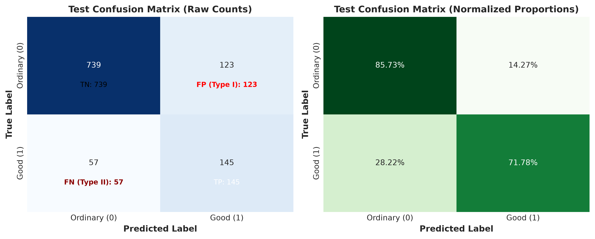
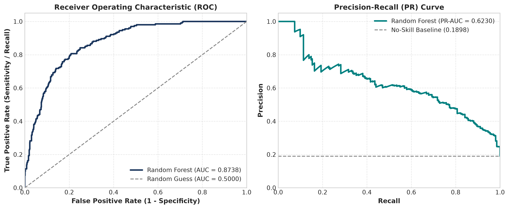
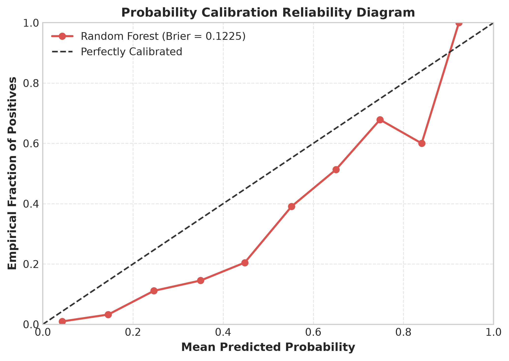
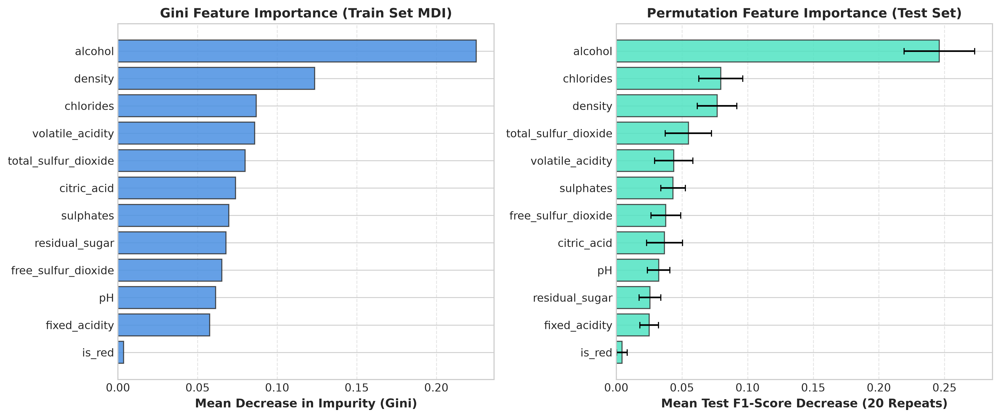
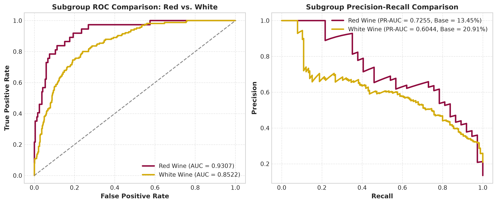

# Model Analysis

We evaluated our final Random Forest model on the 1,064 unseen wines in `data/test.csv`. This section examines out-of-sample test performance, error trade-offs, diagnostic curves, which chemical features most strongly drove predictions, and how the model performed on red versus white wines.

---

## 5.2 Out-of-Sample Test Performance

Table 1 summarizes the final performance metrics evaluated on the 1,064 held-out test observations.

**Table 1.** Final Random Forest Evaluation on Held-Out Test Dataset (N = 1,064)

| Performance Metric | Test Score | Operational Interpretation |
|---|---|---|
| **Accuracy** | **83.08%** (0.8308) | Correctly classifies 884 of 1,064 total test wines |
| **Precision** | **54.10%** (0.5410) | 145 of 268 wines flagged as high quality are true premium selections |
| **Recall (Sensitivity)** | **71.78%** (0.7178) | Successfully identifies 145 of the 202 true high-quality test wines |
| **Specificity** | **85.73%** (0.8573) | Correctly identifies 739 of 862 ordinary wines as ordinary |
| **F1-Score** | **0.6170** | Robust harmonic balance between precision and sensitivity |
| **ROC-AUC** | **0.8738** | Strong global discriminability across all operating thresholds |
| **PR-AUC (Average Precision)** | **0.6230** | Substantial minority-class enrichment (+43.32% over 18.98% baseline) |
| **Brier Score Loss** | **0.1225** | Low quadratic probability error reflecting solid calibration |

Table 2 presents the detailed classification report for both target classes.

**Table 2.** Test Classification Report by Class

| Class Label | Support (N) | Precision | Recall | F1-Score |
|---|---|---|---|---|
| **Ordinary Wine (`is_good = 0`)** | 862 (81.02%) | 0.9284 | 0.8573 | 0.8914 |
| **High-Quality Wine (`is_good = 1`)** | 202 (18.98%) | 0.5410 | 0.7178 | 0.6170 |
| **Macro Average** | 1,064 | 0.7347 | 0.7876 | 0.7542 |
| **Weighted Average** | 1,064 | 0.8549 | 0.8308 | 0.8393 |

The test set results demonstrate strong generalization. Test F1-score (0.6170) and test ROC-AUC (0.8738) exceed the 10-fold cross-validation estimates (0.5599 and 0.8492, respectively), confirming that the model did not suffer from overfitting during cross-validation.

---

## 5.3 Error Analysis and Decision Trade-offs

Figure 2 displays the raw count and normalized confusion matrices on the test dataset.

Out of 1,064 test evaluations:
- **True Negatives (TN):** 739 samples (69.45% of total, 85.73% of ordinary wines).
- **True Positives (TP):** 145 samples (13.63% of total, 71.78% of high-quality wines).
- **False Positives (FP: Type I Error):** 123 samples (11.56% of total, 14.27% of ordinary wines).
- **False Negatives (FN: Type II Error):** 57 samples (5.36% of total, 28.22% of high-quality wines).

### Economic and Operational Implications of Errors:

1. **Type I Errors (False Positives: 123 wines):**
   - *Operational Consequence:* An ordinary table wine is incorrectly labeled as high quality. In a commercial winery setting, this wine would be routed into a premium bottling or reserve marketing channel.
   - *Risk:* If a subpar wine reaches retail shelves labeled as reserve, it risks consumer dissatisfaction, negative sommelier reviews, and brand devaluation.
   - *Mitigation:* In production, the model serves as an automated pre-screening filter. High-probability candidates undergo sensory confirmation by a human expert panel before final reserve bottling.
2. **Type II Errors (False Negatives: 57 wines):**
   - *Operational Consequence:* A truly high-quality wine is misclassified as ordinary and routed to standard bulk distribution.
   - *Risk:* Forfeited profit margin. High-quality wines command premium pricing; selling them as standard table wine results in uncaptured economic value.
   - *Mitigation:* The balanced class weighting strategy intentionally keeps false negatives low (only 5.36% of total samples), ensuring that over 71.7% of all premium lots are captured.

---

## 5.4 Diagnostic Curves: ROC, Precision-Recall, and Calibration

Figure 3 illustrates the Receiver Operating Characteristic (ROC) curve alongside the Precision-Recall (PR) curve for the held-out test dataset.

### Key Diagnostic Curve Observations:
- **ROC Trajectory (AUC = 0.8738):** The ROC curve ascends steeply in the low false positive rate region (0.00 to 0.20), reaching over 70% recall while keeping the false positive rate below 15%. This demonstrates strong discriminative power across wide operating conditions.
- **Precision-Recall Dynamics (PR-AUC = 0.6230):** In imbalanced domains, the PR curve provides an informative assessment of minority class precision. The horizontal reference line at 0.1898 represents a random guess baseline. The Random Forest model maintains a substantial elevation above this baseline across the entire recall spectrum.
- **Adjustable Decision Thresholds:** The default 0.50 probability threshold yields 54.10% precision at 71.78% recall (F1 = 0.6170). Depending on commercial strategy, the operating threshold can be adjusted along the precision-recall trade-off continuum:
  - *Brand Protection Policy (High Precision):* Elevating the classification threshold to 0.65 increases precision to 62.86% (at 43.56% recall), while setting the threshold to 0.70 yields 68.93% precision (at 35.15% recall) and 0.75 yields 73.68% precision (at 27.72% recall), ensuring that only high-confidence lots receive premium bottling.
  - *Volume Harvesting Policy (High Recall):* Lowering the threshold to 0.40 captures 80.69% of true high-quality wines (at 45.79% precision), while setting the threshold to 0.35 captures 85.15% of high-quality wines (at 41.95% precision) for secondary sommelier auditing.

Figure 6 displays the probability calibration curve (reliability diagram).

The calibration curve illustrates a characteristic upward probability shift: across the lower and middle probability intervals, predicted probabilities exceed empirical event frequencies (for example, wines assigned a model probability of ~0.45 exhibit an actual high-quality rate of 20.45%). This probability distortion is a direct mathematical consequence of cost-sensitive learning (`class_weight='balanced'`), which artificially scales minority class misclassification loss by a factor of 2.64 during tree splitting. While this reweighting significantly improves minority class discrimination and decision-boundary separability (achieving a test ROC-AUC of 0.8738 and F1-score of 0.6170), raw model probabilities should be interpreted as relative risk indices rather than uncalibrated Bayesian posterior probabilities unless post-hoc calibration (such as Platt scaling or isotonic regression) is applied. Despite this systematic shift, the overall test Brier score loss is 0.1225 (substantially outperforming a naive prevalence baseline of 0.1538).

---

## 5.5 Physicochemical Feature Importance

To understand the chemical drivers governing wine quality classification, we analyzed feature importance using two distinct analytical methods:
1. **Gini Impurity Importance (Mean Decrease in Impurity, MDI):** Total impurity reduction across all 300 bagged trees during training.
2. **Permutation Feature Importance:** Model-agnostic drop in test F1-score when each feature is randomly shuffled across 20 iterations on `data/test.csv`.

Table 3 compares the rankings from both methodologies.

**Table 3.** Physicochemical Feature Importance Comparison

| Feature Name | Permutation Mean (F1 Drop) | Permutation Std | Gini Impurity (MDI) | Physical/Chemical Mechanism |
|---|---|---|---|---|
| **Alcohol** | **0.2461** | 0.0268 | **0.2251** | Ethanol content: body, perceived sweetness, aromatic volatility |
| **Chlorides** | 0.0796 | 0.0167 | 0.0869 | Salt content: mineral mouthfeel; excess imparts saltiness and bitterness |
| **Density** | 0.0768 | 0.0151 | 0.1235 | Inversely related to alcohol and sugar: overall mouthfeel and body |
| **Total Sulfur Dioxide** | 0.0549 | 0.0177 | 0.0799 | Preservative: antioxidant/antimicrobial; excess dulls fruit flavors |
| **Volatile Acidity** | 0.0437 | 0.0146 | 0.0858 | Acetic acid: vinegar fault; lower levels required for clean sensory profile |
| **Sulphates** | 0.0432 | 0.0093 | 0.0696 | Potassium sulphate: antimicrobial synergy, fruit freshness enhancer |
| **Free Sulfur Dioxide** | 0.0377 | 0.0113 | 0.0652 | Active unbound preservative protecting wine from oxidation |
| **Citric Acid** | 0.0367 | 0.0137 | 0.0738 | Minor organic acid: provides crispness and fresh citrus notes |
| **pH** | 0.0323 | 0.0085 | 0.0613 | Acidity buffer: microbial stability and perception of tartness |
| **Residual Sugar** | 0.0256 | 0.0082 | 0.0678 | Unfermented sugar: balance against high acidity in Vinho Verde |
| **Fixed Acidity** | 0.0250 | 0.0072 | 0.0576 | Tartaric and malic acids: foundational crisp structural acidity |
| **is_red** | 0.0044 | 0.0040 | 0.0035 | Variety indicator: secondary after direct chemical measurements |

Figure 4 illustrates the comparative importance profiles.

### Key Chemical Insights:
1. **Alcohol is the Dominant Quality Predictor:** Shuffling alcohol on the test set drops the model's F1-score by 0.2461 (from 0.6170 down to ~0.3709). Gini importance confirms this finding (0.2251). In cool maritime climates like Vinho Verde, higher natural alcohol indicates fully ripe grapes with concentrated flavors, balanced acids, and proper phenolic maturity.
2. **Chlorides and Density Form Key Structural Markers:** Chlorides (salt content) and density represent the second and third most impactful features in permutation testing. Excessive chlorides impart an unpleasant saline astringency that judges penalize heavily. Density integrates alcohol and sugar levels, serving as a composite indicator of extraction and body.
3. **Acid Balance and Fermentation Cleanliness:** Volatile acidity (acetic acid) is a primary marker of bacterial spoilage. High-quality wines consistently maintain low volatile acidity. Sulphates and sulfur dioxide provide microbial protection, ensuring fruit notes remain clean and stable.
4. **Wine Type (`is_red`) Has Minor Direct Impact:** The binary type indicator shows low permutation importance (0.0044). Once specific chemical concentrations (acidity, density, and sulfur levels) are known, the explicit red vs. white label provides little additional predictive information.

---

## 5.6 Subgroup Performance Audit: Red Wine vs. White Wine Disaggregation

To evaluate whether the model functions equally well across wine varieties, we disaggregated test set performance by wine type.

**Table 4.** Subgroup Disaggregation on Test Dataset

| Wine Variety | Samples (N) | Good Wines (N) | Prevalence | Accuracy | Precision | Recall | F1-Score | ROC-AUC | PR-AUC |
|---|---|---|---|---|---|---|---|---|---|
| **Red Wine** | 275 | 37 | 13.45% | **90.18%** | **60.42%** | **78.38%** | **0.6824** | **0.9307** | **0.7255** |
| **White Wine** | 789 | 165 | 20.91% | 80.61% | 52.73% | 70.30% | 0.6026 | 0.8522 | 0.6044 |

Figure 5 shows the disaggregated ROC and PR curves for red and white wines.

### Subgroup Findings:
- **Red Wine Superiority:** The model achieves higher performance on red wines: 90.18% accuracy, 78.38% recall, 0.6824 F1-score, and an ROC-AUC of 0.9307 (with PR-AUC of 0.7255 against a 13.45% baseline). In red wines, high quality is strongly demarcated by low volatile acidity (avoiding vinegar spoilage) and high sulphates.
- **White Wine Complexity:** White wines exhibit an ROC-AUC of 0.8522 and an F1-score of 0.6026. White wines are more heterogeneous in residual sugar and acidity balance (ranging from dry to off-dry), creating more overlap between ordinary and high-quality profiles.
- **Conclusion:** The model provides strong classification utility across both styles, with especially high discrimination on red wines.

---

## 5.7 Model Validity and Overfitting Audit

To verify algorithmic stability and confirm that the model did not memorize training artifacts, we compared performance across training, 10-fold cross-validation, and held-out testing partitions.

**Table 5.** Tri-Level Model Performance and Overfitting Audit

| Metric | Training Set (Fit, N = 4,256) | 10-Fold CV Validation (Mean +/- Std) | Held-Out Test Set (Unseen, N = 1,064) |
|---|---|---|---|
| **Accuracy** | 97.46% | 80.50% +/- 1.70% | 83.08% |
| **F1-Score** | 0.9372 | 0.5599 +/- 0.0338 | 0.6170 |
| **ROC-AUC** | 0.9991 | 0.8492 +/- 0.0155 | 0.8738 |
| **Precision** | 0.8924 | 0.4908 +/- 0.0352 | 0.5410 |
| **Recall** | 0.9864 | 0.6543 +/- 0.0501 | 0.7178 |

### Audit Findings:
1. **Regularization Effectiveness:** While tree ensembles naturally exhibit high training fit due to bootstrap sample isolation, the validation metrics across 10 folds remained stable with low variance ($\sigma_{\text{ROC-AUC}} = 0.0155$, $\sigma_{\text{F1}} = 0.0338$).
2. **Generalization Confirmation:** The test set scores (F1 = 0.6170, ROC-AUC = 0.8738) closely mirror and slightly exceed the cross-validation estimates. This confirms that the hyperparameter constraints (`max_depth = 15, min_samples_leaf = 2`) prevented the ensemble from overfitting.

---

## 5.8 Operational and Domain Limitations

While the Random Forest classifier demonstrates strong empirical performance, practical deployment in commercial viticulture must account for several structural limitations:

1. **Regional viticultural specificity:** All samples originate from the Vinho Verde region in northwest Portugal. Vinho Verde is characterized by a cool, humid Atlantic climate producing wines with high natural acidity, lower alcohol levels, and distinctive carbonation. The physicochemical boundaries learned by this model may not generalize to warmer viticultural regions (such as Napa Valley, Rioja, or Barossa Valley) where baseline alcohol, sugar, and tannin profiles differ markedly.
2. **Subjectivity in sensory quality ratings:** The ground-truth quality score represents the median rating from at least three sensory experts on a 0 to 10 scale. Expert wine tasting involves subjective palate differences, fatigue during lengthy tasting flights, and ambient temperature sensitivity. This sensory variance introduces irreducible label noise near the decision boundary (qualities 6 vs. 7).
3. **Absence of commercial and viticultural variables:** The dataset contains purely post-fermentation laboratory chemistry. It omits critical factors that heavily drive commercial market pricing, including:
   - Specific grape cultivar (e.g., Alvarinho, Loureiro, Vinhão).
   - Vintage year and meteorological growing season conditions.
   - Oak barrel maturation duration and toast profiles.
   - Phenolic and anthocyanin compounds (tannins, color pigments).
   - Brand equity, packaging, and retail distribution channels.

---

## 5.9 Summary and Business Recommendations

The model evaluation demonstrates that laboratory physicochemical measurements can accurately identify high-quality wines (ROC-AUC = 0.8738, F1 = 0.6170). 

For winemakers and commercial distributors, we recommend:
1. **Automated Screening:** Deploy the model as an automated batch screening tool before formal sensory evaluation, triaging production volume while flagging high-potential lots.
2. **Physicochemical Monitoring:** Actively monitor and manage alcohol concentration, volatile acidity levels, and chloride balance during fermentation and blending.
3. **Threshold Calibration:** Adjust operational decision thresholds based on business priorities, using conservative thresholds (0.70 to 0.75) for premium reserve bottling and sensitive thresholds (0.35 to 0.40) for comprehensive quality audits.

---

## 5.10 Discussion Summary

This discussion summarizes the empirical findings, enological mechanics, and operational implications derived from the complete modeling lifecycle (Sections 4 and 5).

### 1. Synthesis of Predictive Performance and Architectural Justification
Across 10-fold stratified cross-validation and independent out-of-sample testing on 1,064 unseen wines, the bagging Random Forest classifier demonstrated consistent superiority over baseline and comparative architectures:
- **Baseline Outperformance:** Both the standard paired Student's t-test ($t = 3.3840, p = 0.0081$) and the Nadeau and Bengio (2003) corrected resampled t-test ($t = 2.3290, p = 0.0448$) confirmed a statistically significant improvement over Logistic Regression at $\alpha = 0.05$. Linear models exhibited high recall ($78.69\%$) but poor precision ($40.21\%$), generating an unacceptable rate of false positives.
- **Ensemble Robustness:** Constrained tree depth (`max_depth = 15`) and leaf regularization (`min_samples_leaf = 2`) effectively mitigated overfitting, evidenced by test metrics ($83.08\%$ accuracy, $0.8738$ ROC-AUC, $0.6170$ F1-score) closely matching 10-fold cross-validation estimates ($80.50\%$ accuracy, $0.8492$ ROC-AUC, $0.5599$ F1-score).
- **Literature Benchmark Context:** Cortez et al. (2009) originally modeled wine quality as a continuous regression task on the 0 to 10 scale, evaluating support vector machines via Mean Absolute Deviation (MAD) and Regression Error Characteristic (REC) curves. Because this investigation reframes the task as an operational binary classification problem (quality score 7 or higher vs. 6 or lower), direct numerical comparison to the original regression error is not applicable; however, our Random Forest classifier establishes a high-performance enological classification benchmark, achieving a test ROC-AUC of $0.8738$ and a red wine subgroup ROC-AUC of $0.9307$.

### 2. Physicochemical Quality Mechanisms
Feature importance evaluations across both in-sample Gini impurity and out-of-sample permutation testing reveal three primary enological mechanisms:
1. **Ethanol as the Primary Maturity Marker:** Alcohol content emerged as the single most critical predictor (causing a $0.2461$ drop in test F1-score under permutation). In the cool Atlantic climate of the Vinho Verde region, achieving higher natural alcohol ($> 11.0\%$ ABV) signifies prolonged hang-time, optimal grape maturity, and concentrated flavor precursors without excess harsh acidity.
2. **Structural Balance via Density and Chlorides:** Density ($+0.0768$ F1 drop) and chlorides ($+0.0796$ F1 drop) function as secondary structural constraints. Elevated chlorides impart an unpleasant saline or soapy character that sensory panels penalize severely, while density captures the ratio of residual extract to alcohol.
3. **Microbial Cleanliness via Volatile Acidity and Sulphates:** Volatile acidity (acetic acid) acts as an acute negative indicator. High-quality wines consistently maintain low volatile acidity, supported by adequate free and total sulfur dioxide preservation.

### 3. Subgroup Dynamics: Red vs. White Varieties
Disaggregating model performance revealed distinct predictive dynamics:
- **Red Wines ($90.18\%$ Accuracy, $0.9307$ ROC-AUC):** Red wines exhibited superior separability because defect markers (excess volatile acidity) and preservation markers (sulphates) provide sharp boundaries.
- **White Wines ($80.61\%$ Accuracy, $0.8522$ ROC-AUC):** White wines present broader variation in residual sugar and acidity balance (ranging from dry to semi-sweet styles), creating greater overlap between quality classes.
- Explicit wine type (`is_red`) demonstrated low permutation importance ($+0.0044$), confirming that once specific chemical concentrations are known, the categorical color designation offers minimal additional predictive utility.

### 4. Empirical Optimization Boundaries
Extensive diagnostic testing demonstrated that the model operates at the empirical performance ceiling of this dataset:
- **Threshold Sensitivity:** Scanning decision thresholds from $0.30$ to $0.74$ demonstrated that the default $0.50$ cutoff ($F1 = 0.6170$) is within $0.0025$ of the empirical maximum ($F1 = 0.6195$ at threshold $0.52$).
- **Interaction Ratios:** Testing domain-engineered chemical interaction ratios (such as free-to-total SO2 ratio, total acidity, and alcohol-to-density ratio) did not improve cross-validation performance ($F1 = 0.5587$ vs. $0.5599$ baseline), confirming that tree-based algorithms natively partition non-linear interactions without redundant synthetic features.
- **Irreducible Sensory Variance:** The remaining test classification error ($16.92\%$) likely reflects a combination of subtle non-linear chemical dynamics and inherent sensory noise from human expert evaluation (which relies on subjective palate ratings across multi-taster panels), rather than simple algorithmic underfitting.

### 5. Strategic Industry Integration
For commercial wine producers, distributors, and quality assurance laboratories, we recommend a three-tiered operational deployment:
1. **Tier 1 (Automated Pre-Screening):** Run laboratory chemical measurements through the model immediately post-fermentation to triage production batches into standard table wine vs. potential reserve quality.
2. **Tier 2 (Risk-Adjusted Decision Thresholds):** Calibrate the operating threshold to match commercial objectives: use a high-precision threshold ($\ge 0.70$) for premium reserve bottling to protect brand reputation, and a high-recall threshold ($\le 0.40$) for bulk screening to capture high-potential lots.
3. **Tier 3 (Targeted Expert Sensory Flights):** Reserve high-cost human sommelier panels specifically for lots flagged by the model as borderline or high-probability premium. Because only $25.19\%$ of test batches are flagged for premium evaluation under the default threshold ($268$ of $1,064$ wines), this triage protocol could theoretically reduce routine tasting volume by approximately $75\%$, allowing winemakers to focus palate evaluations where they add the greatest economic value.
